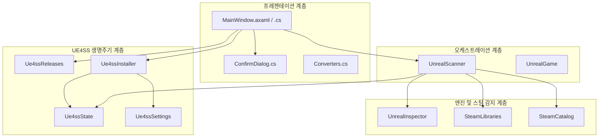
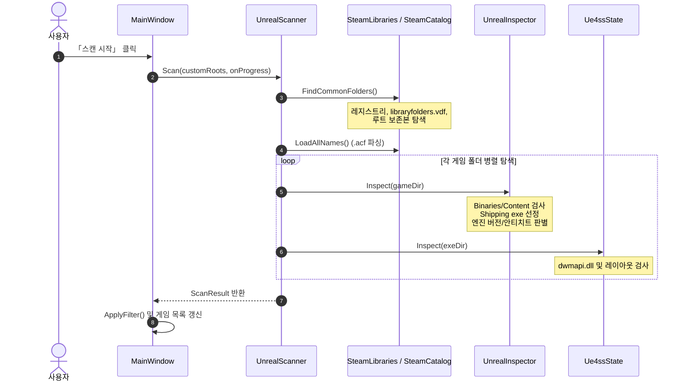
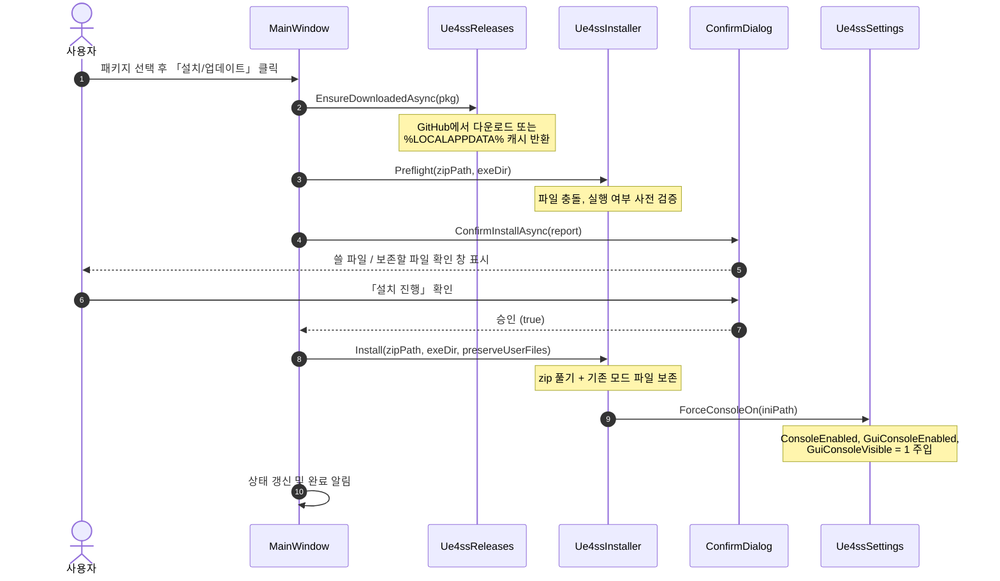

# 시스템 아키텍처 (Architecture)

`ue4ss tool`은 Avalonia UI 기반의 프레젠테이션 계층과 도메인 로직(스팀 감지, 언리얼 분석, UE4SS 수명주기)이 명확히 분리된 구조로 설계되어 있습니다.

---

## 1. 아키텍처 계층 구조

---

## 2. 주요 데이터 파이프라인

### ① 스캔 파이프라인 (Scan Pipeline)

사용자가 **「스캔 시작」**을 누르면 백그라운드 태스크(`Task.Run`)에서 스캔이 진행됩니다:

### ② 설치 및 업데이트 파이프라인 (Install & Update Pipeline)

---

## 3. 핵심 모듈별 책임 및 인터페이스

### 1) 프레젠테이션 계층
* **`MainWindow.axaml / .cs`**:
  * 비동기 스캔 트리거 및 상태 표시줄(진행률, 총 게임 수, 엔진별 통계) 렌더링.
  * `FilterCombo` (UE5, UE4, UE3, 설치됨, 미설치, 안티치트 등)를 통한 클라이언트 사이드 필터링.
  * 액션 버튼: 설치/업데이트, 비활성화 토글, 안전 제거, 바로가기(모드 폴더 열기, ini 열기, 로그 열기).
* **`ConfirmDialog.cs`**:
  * 런타임에 코드로 생성되는 Avalonia 모달 창. 설치/업데이트/제거 시 영향받는 파일 목록을 미리 보여주고 사용자 확인을 받습니다.
* **`Converters.cs`**:
  * `Ue4ssSupportConverter`: 지원 여부에 따라 UI 배지 스타일(녹색/노란색/빨간색) 매핑.

### 2) 도메인 및 스팀 계층
* **`SteamLibraries.cs`**:
  * 레지스트리(`HKCU\Software\Valve\Steam`, `HKLM\SOFTWARE\WOW6432Node\Valve\Steam`)에서 기본 경로 획득.
  * 모든 라이브러리의 `libraryfolders.vdf`를 파싱하여 추가 드라이브 라이브러리 및 `steamapps\common` 폴더 수집.
  * `FindPreservedGameFolders()`: 드라이브 루트(예: `D:\GameName`)에 별도 백업된 비-Steam 언리얼 보존본 폴더 자동 감지.
* **`SteamCatalog.cs`**:
  * `steamapps\appmanifest_<appid>.acf`의 `installdir`과 `name`을 맵핑하여 폴더명 대신 공식 스토어 게임 제목을 표시.
* **`UnrealInspector.cs`**:
  * 폴더를 읽기 전용으로 검사하여 언리얼 프로젝트 구조, 실제 Shipping exe, 엔진 세대/버전, 안티치트를 판정.

### 3) UE4SS 관리 계층
* **`Ue4ssState.cs`**:
  * 게임 exe 폴더에 UE4SS가 설치되어 있는지 감지(`dwmapi.dll` 버전 리소스 제품명이 `UE4SS Injection Proxy`인지 확인).
  * 레이아웃 판별 (`Subfolder`, `Flat`, `LegacyXinput`).
  * `.disabled` 확장자 존재 여부로 활성화/비활성화 상태 반환.
* **`Ue4ssReleases.cs`**:
  * RE-UE4SS GitHub API(`api.github.com/repos/UE4SS-RE/RE-UE4SS/releases`) 호출.
  * 안정판(v3.0.1) 및 실험판(`experimental-latest`) 목록 취득 및 다운로드 캐시 관리.
* **`Ue4ssInstaller.cs`**:
  * zip 배치를 분석하고 대상 폴더에 안전하게 전개.
  * 게임 프로세스 실행 여부 검사(`Process.GetProcessesByName`).
  * 제거 시 `Microsoft.VisualBasic.FileIO.FileSystem.DeleteFile/DeleteDirectory`를 이용해 **윈도우 휴지통**으로 안전 이동.
* **`Ue4ssSettings.cs`**:
  * `UE4SS-settings.ini`의 `[Debug]` 섹션을 분석하여 디버그 및 GUI 콘솔 창 설정을 강제로 `1`로 활성화.
