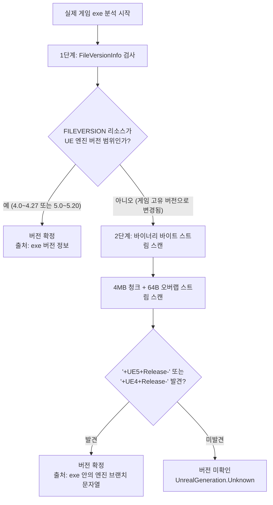

# 언리얼 엔진 판별 알고리즘 (Engine Detection)

`ue4ss tool`의 [UnrealInspector.cs](file:///h:/source/repos/ue4ss%20tool/ue4ss%20tool/UnrealInspector.cs)는 게임 폴더를 읽기 전용으로 검사하여 언리얼 엔진 사용 여부, 실제 실행 바이너리, 엔진 세대 및 세부 버전, 안티치트 등을 정밀하게 도출합니다.

---

## 1. 프로젝트 폴더 탐색 (`FindProjects`)

일반적인 Steam 게임의 설치 루트에는 게임 실행 파일이 바로 없거나, 하위 폴더에 여러 단계로 감싸여 있는 경우가 많습니다.

* **최대 탐색 깊이 (`MaxProjectDepth = 3`)**:
  * 너비 우선 탐색(BFS) 큐를 사용하여 설치 루트부터 최대 3단계 아래까지 하위 폴더를 탐색합니다.
* **스킵 목록 (`SkipDirs`)**:
  * 탐색 성능과 불필요한 IO를 줄이기 위해 다음 폴더는 탐색 큐에 넣지 않습니다:
    `Engine`, `_CommonRedist`, `__Installer`, `DirectX`, `EasyAntiCheat`, `BattlEye`, `ue4ss`, `Mods`, `Saved`, `.git` 등.

### 프로젝트 판단 기준 (`AsProject`)
다음 조건을 모두 만족해야 유효한 UE4/UE5 프로젝트로 판정합니다:
1. 해당 폴더 아래에 `Binaries`와 `Content` 폴더가 동시에 존재해야 합니다.
2. 언리얼 패키징 흔적을 확인합니다:
   * `Content\Paks` 폴더가 존재하거나,
   * 프로젝트 폴더 바로 옆(부모 디렉터리)에 `Engine` 폴더가 존재해야 합니다(Loose 파일 빌드 지원).
3. `Binaries\<Platform>` (`Win64`, `WinGDK`, `Win32` 순서) 폴더 내에 유효한 실행 파일이 있어야 합니다.

---

## 2. 실제 게임 실행 파일 선정 (`PickGameExe`)

`Binaries\Win64` 폴더 안에는 크래시 리포터나 설치 헬퍼, 웹 프로세스 등 다양한 exe가 공존합니다. 도구는 정교한 우선순위 규칙에 따라 실제 게임 exe를 선정합니다.

### ① 헬퍼 실행 파일 배제 (`HelperExe` Regex)
다음 패턴과 일치하는 파일은 후보에서 제외합니다:
```regex
^(CrashReportClient|UnrealCEFSubProcess|EpicWebHelper|UE4PrereqSetup.*|UEPrereqSetup.*|start_protected_game|EasyAntiCheat.*|BEService.*|.*_BE|.*Setup.*|.*Installer.*|.*Uninst.*|UE3ShaderCompileWorker|ShaderCompileWorker|curl|7za?)\.exe$
```

### ② 실행 파일 우선순위
1. **Shipping exe (`*-Win64-Shipping.exe`)**:
   * 프로젝트 이름으로 시작하는 파일 우선 (예: `MyGame-Win64-Shipping.exe`)
   * 프로젝트 폴더명과 exe 이름이 다른 경우(예: 폴더명 `Platform8` ➔ 파일명 `Exit8-Win64-Shipping.exe`), 용량이 가장 큰 Shipping exe 선택.
2. **`<프로젝트명>.exe`**:
   * Shipping 접미사가 없는 독립 빌드 파일.
3. **가장 파일 크기가 큰 exe**:
   * 위의 규칙에 걸리지 않는 경우 가장 용량이 큰 바이너리를 게임 본체로 간주.

---

## 3. 엔진 세대 및 버전 판별 (`ReadEngineVersion`)

엔진 버전은 UE4SS의 호환성을 결정짓는 가장 중요한 기준입니다. 2단계 판별 전략을 사용합니다.



### 1단계: Windows 파일 버전 리소스 검사
언리얼 엔진은 기본 빌드 시 실행 파일의 `FILEVERSION`에 엔진 버전(예: `5.3.2.0`)을 기록합니다.
* **타당성 검사 (`EngineVersion.IsPlausible`)**:
  * Major가 4인 경우: Minor가 `0` ~ `27` 사이여야 유효.
  * Major가 5인 경우: Minor가 `0` ~ `20` 사이여야 유효.
  * 만약 게임 개발사가 파일 버전을 `1.0.8767`처럼 자체 빌드 버전으로 바꾼 경우, 이 단계를 통과하지 못하고 2단계로 넘어갑니다.

### 2단계: 바이너리 브랜치 문자열 스캔 (`ScanBranchString`)
언리얼 엔진 바이너리 내부에는 빌드 시 엔진 릴리스 브랜치 문자열이 삽입됩니다 (UE 4.2x 이후).
* **바이트 시그니처 (Needles)**:
  * UTF-16 및 ASCII 인코딩: `+UE5+Release-`, `+UE4+Release-`
* **청크 스트리밍 방식**:
  * 메모리 낭비를 방지하기 위해 `4MB` 단위의 버퍼로 순차 읽기를 수행합니다.
  * 청크 경계에 문자열이 잘려서 검색되지 않는 문제를 방지하기 위해 **64바이트 오버랩(Overlap)**을 적용하여 이전 청크의 끝부분을 다음 청크 앞단에 복사합니다.
* **버전 추출 정규식**:
  ```regex
  \+UE([45])\+Release-(\d)\.(\d{1,2})
  ```
  추출된 버전(예: `5.2`)의 타당성을 검증하여 버전을 확정합니다.

---

## 4. 언리얼 엔진 3 (UE3) 레거시 판별 (`FindUe3`)

UE3는 UE4SS 지원 대상이 아니지만, 사용자가 게임 유형을 명확히 알 수 있도록 탐지하여 UI에 표시합니다.
* **UE3 디렉터리 특징**:
  * `Binaries\Win64` 또는 `Binaries\Win32` 폴더 존재.
  * 폴더 내에 `<GameName>Game\Cooked*` (예: `CookedPC`, `CookedPCConsole`) 구조 존재.

---

## 5. 부가 특성 감지

* **IoStore 감지 (`UsesIoStore`)**:
  * `Content\Paks` 내에 `*.utoc` 파일이 존재하는지 확인합니다. UE5의 차세대 컨테이너 패키징(IoStore) 사용 여부를 표시합니다.
* **안티치트 감지 (`DetectAntiCheat`)**:
  * 설치 루트 또는 exe 폴더에서 다음을 확인하여 비트 플래그로 감지합니다:
    * **EasyAntiCheat**: `EasyAntiCheat` 폴더 또는 `start_protected_game.exe`
    * **BattlEye**: `BattlEye` 폴더 또는 `*_BE.exe`
  * 안티치트가 켜진 온라인 게임에 DLL을 주입할 경우 제재 위험이 있으므로 UI에서 경고 배지를 띄웁니다.
